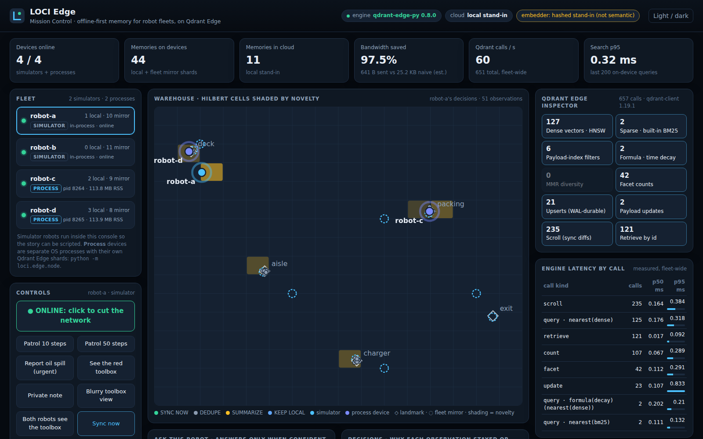

# LOCI Edge: offline-first memory and intelligence for robot fleets, on Qdrant Edge

> **A robot's memory is a place and a moment, so deciding what to send, what is a duplicate,
> and what is a conflict are geometric questions. Only surprise crosses the wire.**

This is the answer to *Problem Statement 03: AI-Powered Edge Memory & Intelligence Platform*.
Every device keeps its own searchable **Qdrant Edge** shards, works fully offline, decides on the
device what is worth syncing, reconciles conflicting sightings by place and time in the cloud, and
receives fleet-level knowledge pushed back down. Devices can be separate OS processes (or separate
machines) talking to the cloud over HTTP.



## Quickstart (no Docker, no Qdrant Server, no API key)

```bash
git clone https://github.com/daksh777f/qdrant.git && cd qdrant
make setup                        # pip install -e ".[dev,edge-ui]"
make fleet                        # mission control + 2 edge-device processes -> http://127.0.0.1:8765
make verify                       # 12 checks on synthetic streams, about 40 s, fails loudly
make eval                         # evaluation on public human-labelled datasets
```

Walkthrough: [DEMO_SCRIPT.md](DEMO_SCRIPT.md). Recording (about 2 min): [assets/edge-demo.webm](assets/edge-demo.webm).
`make record` regenerates it; every narrated step is asserted, so the video cannot show something
that did not happen.

## Data honesty: what every number is measured on

| Source | What it is | Used for |
|---|---|---|
| **Public human-labelled datasets** (`make eval`) | STS-Benchmark, MSRP (Microsoft paraphrase corpus), SICK: real sentences and human judgements, fetched from pinned URLs and **verified by SHA-256** before use | retrieval quality of Qdrant Edge (BM25 / dense / hybrid), duplicate detection vs human judges, abstention on answerable vs unanswerable questions |
| **Synthetic, seeded streams** (`make verify`) | simulated patrols with known ground truth (which object, where, when) | bandwidth vs events kept, negative controls, convergence, conflict accuracy |
| **Live measurement** (the UI) | every Qdrant Edge call timed as it happens; process RSS/CPU/disk from the OS | latency, throughput, device footprint |

Nothing is hardcoded: the UI's evidence panel reads the result files, and each result file is
written only by its benchmark script.

**Embedder.** Semantic numbers need a learned model. The default is a hashed bag-of-words
**stand-in** (zero downloads; the UI flags it). For real embeddings set `LOCI_EMBEDDER=fastembed`
(Qdrant's `fastembed`, all-MiniLM-L6-v2, 384-d) or `LOCI_EMBEDDER=onnx:/path/to/model`. The
committed real-data results were produced with the stand-in and are labelled so; this sandbox could
not download model weights. Re-running `make eval` with a real model is the one measurement still
owed (the script checks the model against its published STS-B score, about 0.82).

## The eight goals, and where each is met

| PS03 goal | What implements it | Evidence |
|---|---|---|
| Searchable semantic memory on the device | `EdgeMemoryStore`: Qdrant Edge shards (writable + fleet mirror), named dense + BM25 sparse vectors, integer Hilbert-cell and time payload indexes, provenance and versions on every record | the whole pre-existing LOCI suite also passes on Edge (`make test BACKEND=edge`) |
| Low-latency vector and hybrid search offline | dense HNSW + Qdrant's built-in BM25, fused with RRF; on-device **recency decay** (Qdrant `Formula` + `Decay`) and **MMR** diversity | real data: recall@10 0.988 (hybrid), BM25 p95 1.3 ms over 9,225 sentences; synthetic 5,000 x 384-d: recall@10 1.0 vs exact, hybrid p95 2.1 ms |
| Decide what stays local and what syncs | `SyncPolicy` (private / urgent / duplicate / moved / new / ambiguous), judged against the device's own shard **and** the fleet mirror; every verdict stored with its evidence | 14.7% of bytes with 100% of events kept (synthetic ground truth); 0% of 300 genuinely new memories suppressed |
| Sync with the server when connectivity returns | durable SQLite outbox (backoff + jitter), idempotent push, delta pull; cloud = local stand-in, **Qdrant Server** (`QdrantServerCloud`) or **HTTP** (`cloud_http`) | one contract suite passes on all three cloud backends (31 tests) |
| Intermittent connectivity | every read and write is local; device processes survive outages and `kill -9` | `tests/test_edge_multiprocess.py`: outage, kill -9 mid-outage, restart, backlog delivered |
| Evolving and conflicting memory | order-independent place-and-time reconciler (merge / moved / needs-review), audit log, human review inbox, role revisions pushed back to devices | 80/80 labelled pairs; MSRP: 0% false merges at the dedupe threshold |
| User-facing inspection | mission control: fleet (simulators + processes with live telemetry), map, decisions, sync diff, gated ask, **Qdrant Edge inspector**, cloud inbox, evidence | browser-tested, `make record` |
| A real edge-to-cloud AI workflow | cloud briefings pushed into every mirror (optional free-tier LLM, rule-based fallback); answer gate that answers locally, escalates to the cloud and caches, or abstains | real data: gate ROC-AUC 0.894 separating answerable from unanswerable questions |

## Qdrant, visibly at the core

Every Qdrant call in the fleet goes through a thin proxy (`loci/edge/qdrant_ops.py`) that times it
and records what it was, read from the request itself. The inspector shows these live, so a judge
can watch the engine work. Capabilities in use:

| Qdrant capability | Where it is used |
|---|---|
| Qdrant Edge embedded shards (`qdrant-edge-py`) | every device: a writable shard + a read-only fleet mirror |
| Named vectors: dense + sparse | `dense` (HNSW) and `bm25` in the same shard |
| Built-in BM25 model (`Bm25`) | on-device keyword retrieval, no model download |
| Hybrid retrieval with RRF | dense and BM25 branches over both shards, fused |
| Payload indexes + filters | integer Hilbert-cell buckets, time ranges, sync state, roles ("where is it now?") |
| `Formula` + exponential `Decay` | recency-aware ranking computed inside the engine |
| MMR | diverse results instead of near-duplicates |
| Facets | on-device counts for dashboards (sync state, roles) |
| WAL durability | crash safety, verified with `kill -9` |
| Qdrant Server via `qdrant-client` | optional cloud (`LOCI_QDRANT_URL`); same contract |
| `fastembed` | the recommended real embedder |

## Edge computing, for real

`python -m loci.edge.node --name robot-c --cloud http://<mission-control>:8765` starts a device as
its own process with its own data directory, Qdrant Edge shards, outbox and patrol loop. It sends
telemetry in heartbeats (PID, RSS, CPU, allocated disk, per-call Qdrant latencies, queue, position,
recent decisions) and takes commands in the reply (drop the uplink for N seconds, report an event).
`make fleet` launches two of them next to mission control. During an outage the device keeps
deciding and remembering and its heartbeats really stop. Kill it and restart it: memories, the
outbox and the decision history are on its disk. For devices on other machines, set
`LOCI_CLOUD_TOKEN` on both sides (bearer token on every cloud call).

Measured footprint of a device process in this setup: about 114 MB RSS (Python + Qdrant Edge),
under 1 MB of disk for a few hundred memories, 1 to 3% CPU at one step per second.

## How the decisions are made

**Sync policy** (first match wins; every verdict stored with similarity, distance, thresholds):

| Situation | Verdict |
|---|---|
| marked private | `KEEP_LOCAL`, never leaves the device (enforced again at push) |
| marked urgent | `SYNC_NOW` |
| near-identical to something known, same place | `DEDUPE` (only a sighting counter changes) |
| near-identical but somewhere else | `SYNC_NOW` ("moved") |
| nothing known is similar (cosine < 0.85) | `SYNC_NOW` (new; an absolute rule) |
| look-alike (0.85 to 0.95) | `SYNC_NOW` (identity ambiguous; the cloud adjudicates) |
| opt-in `hold_back_familiar`: familiar re-view of the device's own memory | `SUMMARIZE_SYNC` or `KEEP_LOCAL` |

**Conflicts** (cloud side, order-independent, audited): duplicates in the same place and time
window merge (higher confidence wins, then newer); the same thing elsewhere keeps both and the
newest is `current`; look-alikes between 0.85 and 0.95 wait for a human.

**Answer gate**: confidence = 0.5 similarity + 0.3 wording overlap + 0.2 margin (scaled by
similarity) minus staleness, then `ANSWER_LOCAL`, `ESCALATE_CLOUD` (answer from the cloud and cache
into the mirror), `LOW_CONFIDENCE_OFFLINE` (flagged guess) or `ABSTAIN`.

## Measured results

**Real public data** (`make eval`, stand-in embedder; full table in
[`benchmarks/results/edge_real_eval_standin.md`](../benchmarks/results/edge_real_eval_standin.md)):
495 paraphrase queries, one correct answer each, among 9,225 real sentences, on a Qdrant Edge shard.

| Retrieval mode | recall@1 | recall@10 | p95 |
|---|---:|---:|---:|
| BM25 (Qdrant Edge sparse) | 0.899 | 0.976 | 1.3 ms |
| dense (stand-in embedder) | 0.782 | 0.857 | 1.2 ms |
| hybrid RRF | 0.788 | **0.988** | 2.3 ms |

* Answer gate: ROC-AUC 0.894; answers 85% of answerable questions but also **12% of unanswerable
  ones**. Synthetic junk queries (0% answered) were far too easy; this is the honest number.
* Duplicate detection vs human judges (MSRP): at the 0.95 dedupe threshold, 0% false merges but
  only 1.2% of true paraphrases merged. Text alone is weak evidence of "same thing", which is why a
  merge also requires the same place and time.

**Synthetic ground truth** (`make verify`, 12/12 checks; [`benchmarks/results/edge_verify.md`](../benchmarks/results/edge_verify.md)):

| Check | Result |
|---|---|
| Bytes sent at the default setting | 14.7% of sending everything (floor 8.0%) |
| Events still retrievable | 100% (place-blind dedupe: 88%; at cosine 0.70: 90% vs 55%) |
| New random memories synced / repeats suppressed | 100% / 99.7% |
| Two robots converge after an outage | 1 round, about 0.3 s |
| Conflict engine on labelled pairs | 80/80 |
| Private memories reaching the cloud when force-queued | 0 of 15 |


**Quantization** (`benchmarks/edge_quantization.py`, 150k x 384 and 50k x 1024, synthetic
clustered vectors): scalar int8 cost recall (0.91 at 1024-d) and did not reduce resident memory;
binary quantization dropped recall to about 0.3. It stays off by default; measure on your own
embeddings before enabling it.

## Running against a real Qdrant Server

```bash
make qdrant-up        # docker run qdrant/qdrant on :6333
make verify-server    # the whole harness with Qdrant Server as the cloud
make ui-server        # mission control on it; the "cloud" chip shows which cloud is live
make test-server      # the cloud contract suite against the live server
```

or set `LOCI_QDRANT_URL` (+ `LOCI_QDRANT_API_KEY`, `LOCI_QDRANT_COLLECTION`). An unreachable
server falls back to the local stand-in **visibly**. Outages (refused, timeout, 5xx, 429) become
`LinkDown`, so the device outbox keeps everything; a wrong API key is reported as an error.

Verified: the contract suite and the whole platform on qdrant-client's in-process engine, and the
HTTP error paths against a fake server. **Not verified here:** a live Qdrant Server (no Docker
daemon in the build environment). Run `make qdrant-up test-server verify-server` once to close it.

## Configuration

* `LOCI_EMBEDDER` = `hash:64` (default) | `fastembed[:model]` | `onnx:/dir`
* `LOCI_QDRANT_URL`, `LOCI_QDRANT_API_KEY`, `LOCI_QDRANT_COLLECTION`: cloud on Qdrant Server
* `LOCI_CLOUD_TOKEN`: bearer token between devices and mission control
* LLM briefings (cloud side only, private memories never reach it): `GROQ_API_KEY`,
  `CEREBRAS_API_KEY` or `GEMINI_API_KEY`, or `LOCI_LLM_BASE_URL` + `LOCI_LLM_API_KEY`
* `PolicyConfig`: `dedupe_similarity` 0.95, `same_place_radius` 0.05, `ambiguous_similarity` 0.85,
  `hold_back_familiar` off. `GateConfig.answer_threshold` 0.5.

## Known limitations

* **No live Qdrant Server run yet** (see above), and no Qdrant Edge snapshot-based shard sync:
  devices pull a version-based delta.
* **Semantic results need a real model**; the committed ones use the labelled stand-in.
* **LLM path** tested against a fake OpenAI-compatible server only.
* Robot sensing is simulated (landmark descriptions plus noise); positions are normalised 2-D.
* The reconciler scans the whole cloud each pass: fine for demos, not for large fleets.
* Mission control's own UI has no login; keep it on localhost or behind a proxy.

## Where things live

`loci/edge/`: `store.py` (Edge shards, hybrid/decay/MMR/facets), `qdrant_ops.py` (inspector),
`policy.py`, `sync.py`, `outbox.py`, `conflicts.py`, `gate.py`, `cloud_ai.py`, `cloud.py`,
`cloud_server.py`, `cloud_http.py`, `node.py`, `embed.py`, `sim.py`, `ui/`. Benchmarks:
`benchmarks/edge_verify.py`, `edge_real_eval.py`, `edge_quantization.py`, `edge_latency.py`.
Plan and decisions: [PS03_GAP_ANALYSIS_AND_PLAN.md](PS03_GAP_ANALYSIS_AND_PLAN.md).
